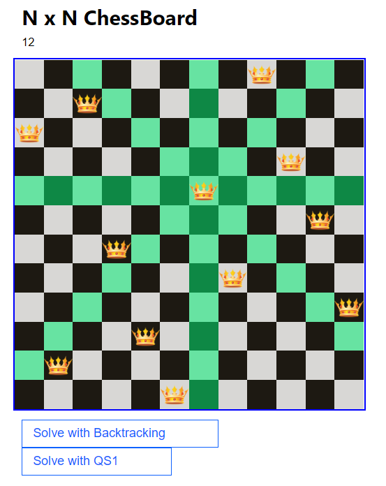

This project is for educational purposes only. 
Live deploy -> [Click here](https://gerssonn.github.io/nqueens/)

## About NQueens

The problem is to place n queens in such a manner on an n x n chessboard that no queens attack each other by being in the same row, column or diagonal.

## Algorithms

Until now only 2 algorithms have been implemented:
- Backtracking
- QS1 based on: [How to Search for Millions of Queens](https://core.ac.uk/download/pdf/276277375.pdf)

## How to run

- Clone the repo
- run `npm start`

## Features:

- [X] Queens
- [X] Free dimensional board
- [X] Queens attack positions
- [ ] Diplay number of iterations
- [ ] Visualize the algorithms
